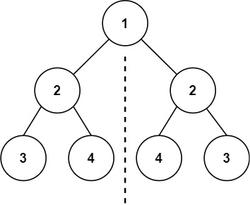
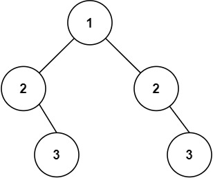

# [101. 对称二叉树](https://leetcode.cn/problems/symmetric-tree/)


## 题目

给你一个二叉树的根节点 `root` ， 检查它是否轴对称。

 

**示例 1：**



```
输入：root = [1,2,2,3,4,4,3]
输出：true
```

**示例 2：**



```
输入：root = [1,2,2,null,3,null,3]
输出：false
```

 

**提示：**

- 树中节点数目在范围 `[1, 1000]` 内
- `-100 <= Node.val <= 100`

 

**进阶：**你可以运用递归和迭代两种方法解决这个问题吗？


## 题解

- 时间复杂度：O(n)
- 空间复杂度：O(n)

```cpp
/**
 * Definition for a binary tree node.
 * struct TreeNode {
 *     int val;
 *     TreeNode *left;
 *     TreeNode *right;
 *     TreeNode() : val(0), left(nullptr), right(nullptr) {}
 *     TreeNode(int x) : val(x), left(nullptr), right(nullptr) {}
 *     TreeNode(int x, TreeNode *left, TreeNode *right) : val(x), left(left), right(right) {}
 * };
 */
class Solution
{
    bool isSameTree(TreeNode *p, TreeNode *q)
    {
        if (p == nullptr || q == nullptr)
            return p == q;

        return p->val == q->val && isSameTree(p->left, q->right) && isSameTree(p->right, q->left);
    }

public:
    bool isSymmetric(TreeNode *root)
    {
        return isSameTree(root->left, root->right);
    }
};
```


## points

1. 利用相同的树

2. 根节点已经对称，所以要判断的是左右两子树是否是对称的

   和完全相同不同的一点是，不是左=左，右=右；而是要求左=右，右=左

3. 修改相同的树，使得满足2.所述的：对于一个节点和它的对称节点，要求 本节点值相等、a的左子树=b的右子树，a的右子树=b的左子树。