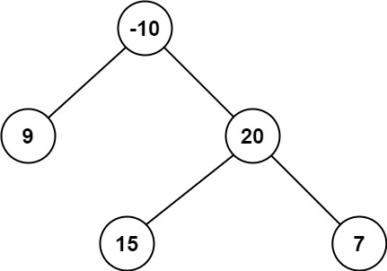

# [124. 二叉树中的最大路径和](https://leetcode.cn/problems/binary-tree-maximum-path-sum/)


## 题目

二叉树中的 **路径** 被定义为一条节点序列，序列中每对相邻节点之间都存在一条边。同一个节点在一条路径序列中 **至多出现一次** 。该路径 **至少包含一个** 节点，且不一定经过根节点。

**路径和** 是路径中各节点值的总和。

给你一个二叉树的根节点 `root` ，返回其 **最大路径和** 。

 

**示例 1：**


```
输入：root = [1,2,3]
输出：6
解释：最优路径是 2 -> 1 -> 3 ，路径和为 2 + 1 + 3 = 6
```

**示例 2：**



```
输入：root = [-10,9,20,null,null,15,7]
输出：42
解释：最优路径是 15 -> 20 -> 7 ，路径和为 15 + 20 + 7 = 42
```

 

**提示：**

- 树中节点数目范围是 $[1, 3 * 10^4]$
- `-1000 <= Node.val <= 1000`


## 题解

```cpp
/**
 * Definition for a binary tree node.
 * struct TreeNode {
 *     int val;
 *     TreeNode *left;
 *     TreeNode *right;
 *     TreeNode() : val(0), left(nullptr), right(nullptr) {}
 *     TreeNode(int x) : val(x), left(nullptr), right(nullptr) {}
 *     TreeNode(int x, TreeNode *left, TreeNode *right) : val(x), left(left), right(right) {}
 * };
 */
class Solution
{
    int ans = INT_MIN;

    int dfs(TreeNode *node)
    {
        if (!node)
            return 0;
        int left = dfs(node->left);
        int right = dfs(node->right);
        int me = node->val;
        ans = max({ans, left + right + me});
        return max(max(left, right) + me, 0);
    }

public:
    int maxPathSum(TreeNode *root)
    {
        dfs(root);
        return ans;
    }
};
```


## points

1. 此题和kadane算法的dp动态规划一样。重点在于，我们返回给上一级递归的，需要与0进行比较，若小于0，那就不应该让当前的整个子树包含进去。这和kadane算法一样：维护以当前数为右端点的数组和的最大值，若为负，则清空，从右侧第一个开始

2. 递归的时候，对于每一个结点，它所做的任务就是判断在当前结点这个子树下能够得到的最大值，来判断是否更新ans。具体操作为，若非空，就直接递归左右子树，然后得到左右子树得到的值。下面就来进行拼接，因为每一个结点只要分开管理自己当前子树的最大值即可，所以当前node直接把自己和左右子树最大值都直接进行拼接，然后得到的值与ans进行比较即可。

   下一步向上返回递归的时候，需要判断交回给上一层到底是哪一条链，只能是左和自己 或 右和自己，且要和0进行比较，如果为负，那就直接返回0，这样保证上层能够达到最大值

3. 注意ans的初始化应该是INT_MIN