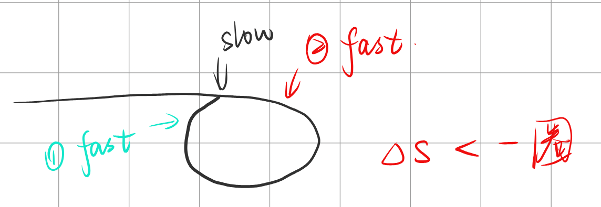

# [141. 环形链表](https://leetcode.cn/problems/linked-list-cycle/)

## 题目

给你一个链表的头节点 `head` ，判断链表中是否有环。

如果链表中有某个节点，可以通过连续跟踪 `next` 指针再次到达，则链表中存在环。 为了表示给定链表中的环，评测系统内部使用整数 `pos` 来表示链表尾连接到链表中的位置（索引从 0 开始）。**注意：`pos` 不作为参数进行传递** 。仅仅是为了标识链表的实际情况。

*如果链表中存在环* ，则返回 `true` 。 否则，返回 `false` 。

 

**示例 1：**


```
输入：head = [3,2,0,-4], pos = 1
输出：true
解释：链表中有一个环，其尾部连接到第二个节点。
```

**示例 2：**


```
输入：head = [1,2], pos = 0
输出：true
解释：链表中有一个环，其尾部连接到第一个节点。
```

**示例 3：**


```
输入：head = [1], pos = -1
输出：false
解释：链表中没有环。
```

 

**提示：**

- 链表中节点的数目范围是 `[0, 104]`
- `-105 <= Node.val <= 105`
- `pos` 为 `-1` 或者链表中的一个 **有效索引** 。

 

**进阶：**你能用 `O(1)`（即，常量）内存解决此问题吗？


## 题解

- 时间复杂度：O(n)
- 空间复杂度：O(1)

```cpp
/**
 * Definition for singly-linked list.
 * struct ListNode {
 *     int val;
 *     ListNode *next;
 *     ListNode(int x) : val(x), next(NULL) {}
 * };
 */
class Solution
{
public:
    bool hasCycle(ListNode *head)
    {
        // 由于相对速度只有1，那么一定可以追上
        // 存在两种情况：1. 慢到达环起点的时候，快恰好马上到起点，那么很快追上
        // 2. 慢到达起点的时候，快恰好在慢前面一点点，那么相当于快在慢的后面 不到一圈的位置
        // 由于相对速度为1，则快追上慢的时候，慢就刚好走了刚才那 不到一圈的距离
        // 综上，慢进入环以后，快一定是在一圈内，就刚好追上慢了
        ListNode *slow = head, *fast = head;
        while (fast && fast->next)
        {
            fast = fast->next->next;
            slow = slow->next;
            if (fast == slow)
                return true;
        }
        return false;
    }
};
```


## points

1. 于相对速度只有1，那么一定可以追上

   存在两种情况：1.慢到达环起点的时候，快恰好马上到起点，那么很快追上

   慢到达起点的时候，快恰好在慢前面一点点，那么相当于快在慢的后面 不到一圈的位置

   由于相对速度为1，则快追上慢的时候，慢就刚好走了刚才那 不到一圈的距离

   综上，慢进入环以后，快一定是在一圈内，就刚好追上慢了

   

2. 如果true，会得到fast==slow，直接return即可

   如果false，要找到循环退出的条件，即是单链表，则fast最终会走到结束

   由于fast一次走两步，则需要对fast和fast->next都进行非空判断，一旦有一个为空，则立即退出