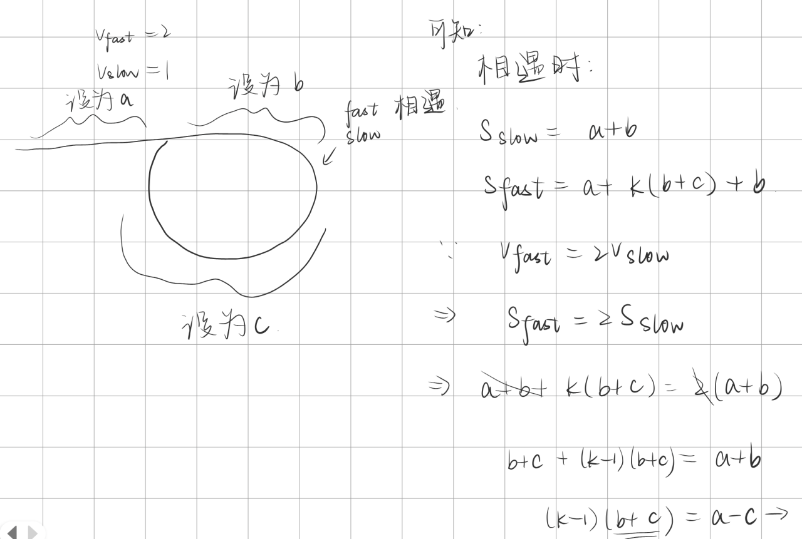
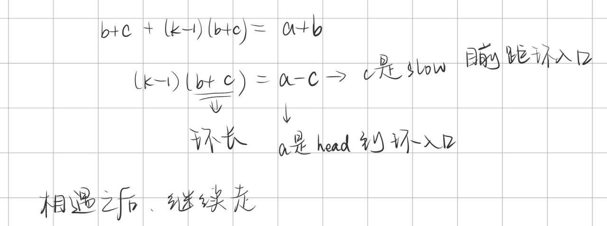

# [142. 环形链表 II](https://leetcode.cn/problems/linked-list-cycle-ii/)


## 题目

给定一个链表的头节点  `head` ，返回链表开始入环的第一个节点。 *如果链表无环，则返回 `null`。*

如果链表中有某个节点，可以通过连续跟踪 `next` 指针再次到达，则链表中存在环。 为了表示给定链表中的环，评测系统内部使用整数 `pos` 来表示链表尾连接到链表中的位置（**索引从 0 开始**）。如果 `pos` 是 `-1`，则在该链表中没有环。**注意：`pos` 不作为参数进行传递**，仅仅是为了标识链表的实际情况。

**不允许修改** 链表。

 

**示例 1：**


```
输入：head = [3,2,0,-4], pos = 1
输出：返回索引为 1 的链表节点
解释：链表中有一个环，其尾部连接到第二个节点。
```

**示例 2：**


```
输入：head = [1,2], pos = 0
输出：返回索引为 0 的链表节点
解释：链表中有一个环，其尾部连接到第一个节点。
```

**示例 3：**


```
输入：head = [1], pos = -1
输出：返回 null
解释：链表中没有环。
```

 

**提示：**

- 链表中节点的数目范围在范围 `[0, 104]` 内
- `-105 <= Node.val <= 105`
- `pos` 的值为 `-1` 或者链表中的一个有效索引


## 题解

- 时间复杂度：O(n)
- 空间复杂度：O(1)

```cpp
/**
 * Definition for singly-linked list.
 * struct ListNode {
 *     int val;
 *     ListNode *next;
 *     ListNode(int x) : val(x), next(NULL) {}
 * };
 */
class Solution
{
public:
    ListNode *detectCycle(ListNode *head)
    {
        ListNode *slow = head, *fast = head;
        int tag = 0;
        while (fast && fast->next)
        {
            fast = fast->next->next;
            slow = slow->next;
            if (fast == slow)
            {
                tag = 1;
                break;
            }
        }
        if (tag == 0)
            return nullptr;
        
        while(head!=slow)
        {
            slow=slow->next;
            head=head->next;
        }
        return head;
    }
};
```


## points

1. 相遇之后，确定有换，要找出环的起点

2. 考虑相遇时的情况

   

   

   可以发现一个事实：如果相遇之后，继续走，并且让head以和slow一样的速度走。当slow走到环入口的时候，此时二者均走了c的长度，head到环入口的剩余距离a-c，恰好是环长b+c的整数倍

   又slow就在环入口，由此可知，继续走下去，head和slow会恰好在环入口处相遇。最后返回head或slow均可

