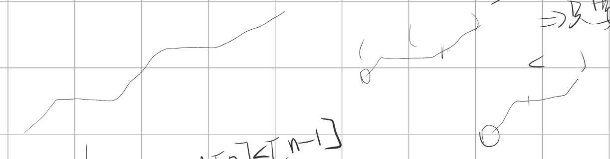
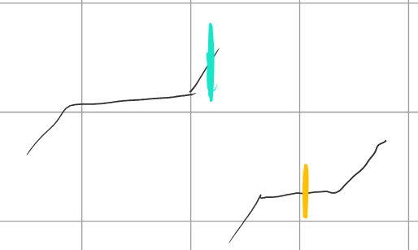

# [154. 寻找旋转排序数组中的最小值 II](https://leetcode.cn/problems/find-minimum-in-rotated-sorted-array-ii/)

[代码.cpp](./154.cpp)

## 题目

已知一个长度为 `n` 的数组，预先按照升序排列，经由 `1` 到 `n` 次 **旋转** 后，得到输入数组。例如，原数组 `nums = [0,1,4,4,5,6,7]` 在变化后可能得到：

- 若旋转 `4` 次，则可以得到 `[4,5,6,7,0,1,4]`
- 若旋转 `7` 次，则可以得到 `[0,1,4,4,5,6,7]`

注意，数组 `[a[0], a[1], a[2], ..., a[n-1]]` **旋转一次** 的结果为数组 `[a[n-1], a[0], a[1], a[2], ..., a[n-2]]` 。

给你一个可能存在 **重复** 元素值的数组 `nums` ，它原来是一个升序排列的数组，并按上述情形进行了多次旋转。请你找出并返回数组中的 **最小元素** 。

你必须尽可能减少整个过程的操作步骤。

 

**示例 1：**

```
输入：nums = [1,3,5]
输出：1
```

**示例 2：**

```
输入：nums = [2,2,2,0,1]
输出：0
```

 

**提示：**

- `n == nums.length`
- `1 <= n <= 5000`
- `-5000 <= nums[i] <= 5000`
- `nums` 原来是一个升序排序的数组，并进行了 `1` 至 `n` 次旋转

 

**进阶：**这道题与 [寻找旋转排序数组中的最小值](https://leetcode-cn.com/problems/find-minimum-in-rotated-sorted-array/description/) 类似，但 `nums` 可能包含重复元素。允许重复会影响算法的时间复杂度吗？会如何影响，为什么？


## 题解

```cpp
class Solution
{
public:
    int findMin(vector<int> &nums)
    {
        int le = 0, ri = nums.size() - 1;
        while (le < ri)
        {
            int mid = le + (ri - le) / 2;
            if (nums[mid] == nums[ri])
                ri--;
            else if (nums[mid] > nums[ri])
                le = mid + 1;
            else
                ri = mid; // 若当前mid已经指向最小值，则ri应移动到包含mid的区间
        } // 因为设置le<ri，则退出时恰好le=ri，都是最小值答案
        return nums[le];
    }
};
```


## points

1. 多了元素可能相等的情况，即需要特殊处理，如果`nums[0]==nums[n-1]`，会很难判断到底该把le右移还是ri左移

2. 初版考虑分别进行判断，因为显然，二分的过程当中目标值一定一直是在范围内的，所以就可以去判断，当前区间到底是包含左端的一段相等值（含0号元素），还是右端的一段相等值（含n-1号元素）。思路上是对的，即要对相等情况进行额外处理，但是方法上写起来非常复杂。

   **废弃**

3. 下面考虑更简单的做法：

   

   因为已知旋转后，只有两种情况，即 原顺序 或 旋转后的顺序，因此，可以确定的是，每次排除掉最右边的元素是可以的，因为最小值只会出现在 最左边 （原顺序） 或 中间（旋转后）。所以可以考虑每次把最右侧的元素丢弃，即ri，每次在le与ri的区间内进行二分查找，实际上就是把整个数组不断删掉最右的值，从而每次得到更小规模的。

   方法是：如果nums[mid]==nums[ri]（ri一直都在数组的最后，该数组不断更新），则ri--，丢弃ri当前所指的数

   - 若mid所指就是最小值，那么丢弃ri并不会影响我们的判断，因为mid始终在不断更新的这个数组里
   - 若mid所指不是最小值，那么丢弃ri就更没有影响了，不过是排除一个错误答案

   所以，新的方法是每次与数组最后一个数进行比较，由于我们的数组是不断更新的，因此，最后一个数，就是nums[ri]。

   - 若nums[mid]==nums[ri]，丢弃ri所指，即ri--
   - 若nums[mid]>nums[ri]，说明是蓝色情况，则最小值在mid右侧，le=mid+1
   - 若nums[mid]<nums[ri]，说明是黄色情况，则最小是在mid左侧，ri=mid-1
   - 

4. 本题由于相等元素，以及处理二分条件的判断方法不同，因此循环条件改用le<ri，且如果nums[mid]<nums[ri]，由于这个mid可能已经是最小值了，那么ri需要移动到mid，才能保证不会丢失最小值。细节处理与常见二分不同