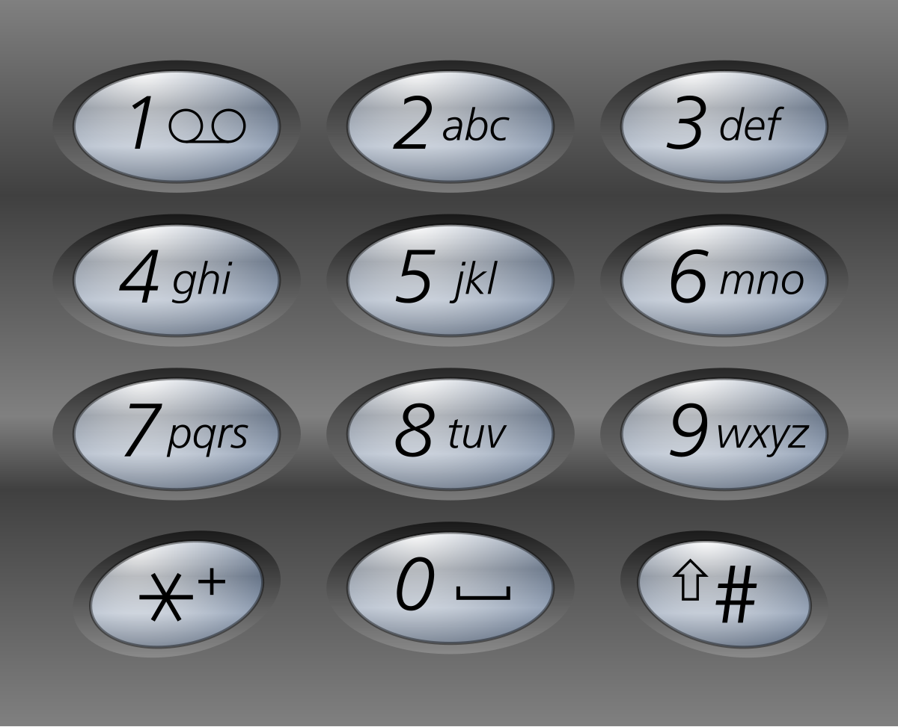

# [17. 电话号码的字母组合](https://leetcode.cn/problems/letter-combinations-of-a-phone-number/)


## 题目

给定一个仅包含数字 `2-9` 的字符串，返回所有它能表示的字母组合。答案可以按 **任意顺序** 返回。

给出数字到字母的映射如下（与电话按键相同）。注意 1 不对应任何字母。



 

**示例 1：**

```
输入：digits = "23"
输出：["ad","ae","af","bd","be","bf","cd","ce","cf"]
```

**示例 2：**

```
输入：digits = ""
输出：[]
```

**示例 3：**

```
输入：digits = "2"
输出：["a","b","c"]
```

 

**提示：**

- `0 <= digits.length <= 4`
- `digits[i]` 是范围 `['2', '9']` 的一个数字。


## 题解

- 时间复杂度: $O(n* 4^n)$。对于映射表，最长一个是4个字符。最终形成字符串的长度是n，则4^n。而在加入到ans的时候，花费O(n)

- 空间复杂度: O(n)。映射哈希表常数级。path和ans都是O(n)的

```cpp
class Solution
{
    unordered_map<int, vector<char>> digit;

    vector<char> path;
    vector<string> ans;
    int n;
    string di;

    void dfs(int i)
    {
        if (i == n)
        {
            string s(path.begin(), path.end()); // 长度都是一样的，不会错乱
            ans.emplace_back(s);
            return;
        }

        vector<char> temp = digit[di[i] - '0']; // 每次从哈希表里取对应字母的时候
        // 对传入的i做了处理，因此dfs的时候传入int i即可
        for (char c : temp)
        {
            path.emplace_back(c);
            dfs(i + 1);
            path.pop_back();
        }
    }

public:
    Solution()
    {
        digit[2] = {'a', 'b', 'c'};
        digit[3] = {'d', 'e', 'f'};
        digit[4] = {'g', 'h', 'i'};
        digit[5] = {'j', 'k', 'l'};
        digit[6] = {'m', 'n', 'o'};
        digit[7] = {'p', 'q', 'r', 's'};
        digit[8] = {'t', 'u', 'v'};
        digit[9] = {'w', 'x', 'y', 'z'};
    }

    vector<string> letterCombinations(string digits)
    {
        if (digits.empty())
            return {};
        n = digits.size();
        di = digits;
        dfs(0);
        return ans;
    }
};
```


## points

1. 笛卡尔积

2. 首先做输入数字与9键字母的映射

3. 复习：

   首先我们需要一个集合的映射表，如2对应abc。选用unordered_map<int, vector<char\>>来存储。声明为成员变量，对其内容的初始化要在Solution的构造函数里进行，和Java一致的

   vector<char\>的path，记录每次尝试寻找到最后得到的一条结果

   vector<string\>的ans，记录所有的答案，从path转化而来，添加进去

   int n，全局变量指示传入digits的长度

   string di，digits的副本，全局

   定义dfs函数，传入int i，表示当前进行到了第几位数字，与string的每一位相对应

   如果当前i==n，说明已经寻找所有可能的结果完毕了，需要回溯。因而将构造好了的path，是一个vector<char\>，通过string的构造函数，传入迭代器的范围，左闭右开，转化为s。然后给ans里加入s，之后return

   下面是path未满足的时候。首先根据传入的i，找到对应当前的数字，通过di[i]-'0'，得到对应int值。然后去哈希表里找，并取出其映射的vector<char\>

   这里对于数字di[i]，显然就有不同的路径选择了。因此要遍历得到的这个vc，每次先加入当前字符c，并dfs(i+1)，然后恢复现场，将cpop掉

   这样dfs就完成了

   接着为了初始化对应的数字与字符映射表，在构造函数内进行

   主函数。首先判断传入的是否有值，若为空串，看返回值是vector<string\>，则return {}

   初始化n

   初始化di

   直接进入dfs，从0开始即可

   返回ans