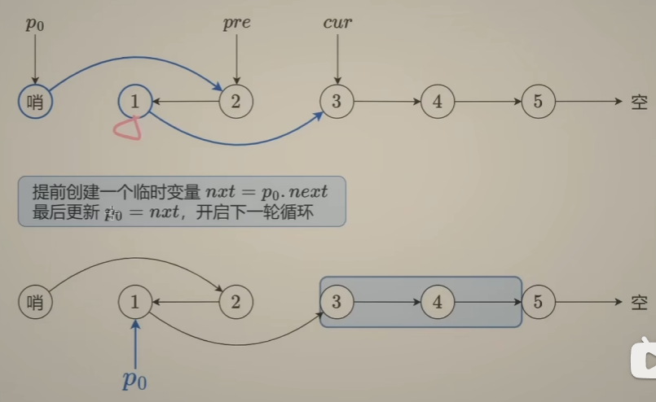

# [25. K 个一组翻转链表](https://leetcode.cn/problems/reverse-nodes-in-k-group/)

[代码.cpp](25.cpp)  

## 题目

给你链表的头节点 `head` ，每 `k` 个节点一组进行翻转，请你返回修改后的链表。

`k` 是一个正整数，它的值小于或等于链表的长度。如果节点总数不是 `k` 的整数倍，那么请将最后剩余的节点保持原有顺序。

你不能只是单纯的改变节点内部的值，而是需要实际进行节点交换。

 

**示例 1：**


```
输入：head = [1,2,3,4,5], k = 2
输出：[2,1,4,3,5]
```

**示例 2：**


```
输入：head = [1,2,3,4,5], k = 3
输出：[3,2,1,4,5]
```

 

**提示：**

- 链表中的节点数目为 `n`
- `1 <= k <= n <= 5000`
- `0 <= Node.val <= 1000`

 

**进阶：**你可以设计一个只用 `O(1)` 额外内存空间的算法解决此问题吗？


## 题解

```cpp
/**
 * Definition for singly-linked list.
 * struct ListNode {
 *     int val;
 *     ListNode *next;
 *     ListNode() : val(0), next(nullptr) {}
 *     ListNode(int x) : val(x), next(nullptr) {}
 *     ListNode(int x, ListNode *next) : val(x), next(next) {}
 * };
 */
class Solution
{
public:
    ListNode *reverseKGroup(ListNode *head, int k)
    {
        ListNode dummy(0, head); // 临时的栈变量
        ListNode *p0 = &dummy;
        ListNode *cur = head, *pre = nullptr;
        int length = 0;
        while (cur)
        {
            length++;
            cur = cur->next;
        }
        for (; length - k >= 0; length -= k) // 每次判断当前剩余节点是否还够k个，如果够，则在当次循环结束后，从length中减去k
        {
            ListNode *p0nxt = p0->next;
            cur = p0nxt;
            for (int i = 0; i < k; i++)
            {
                ListNode *nxt = cur->next;
                cur->next = pre;
                pre = cur;
                cur = nxt;
            }
            p0nxt->next = cur;
            p0->next = pre;
            p0 = p0nxt;
        }
        return dummy.next;
    }
};
```


## points

1. 每次判断是否足够k个，否则不修改

2. 每次需要把p0更新为下一次修改的前置节点，恰好就是p0->next

   

3. 使用时，p0->next需要存储起来，方便后续使用

4. `ListNode dummy(0, head);`创建一个值为0，next指向head的临时节点

   是一个栈变量，不是指针，且只会在当前函数作用域内生效

   是一个假的头节点

5. 每次尝试对下一组k个节点进行反转前，先判断当前剩下的是否足够，注意，应该是`length-k>=0`，如果恰好剩下k个，也是可以的

6. 判断如果足够的话，就可以进行下一次的反转。k个一组的内部操作反转链表II是一样的。需要注意的是在串联每一组的时候，需要对p0进行移动