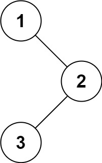

# [94. 二叉树的中序遍历](https://leetcode.cn/problems/binary-tree-inorder-traversal/)


## 题目

给定一个二叉树的根节点 `root` ，返回 *它的 **中序** 遍历* 。

 

**示例 1：**



```
输入：root = [1,null,2,3]
输出：[1,3,2]
```

**示例 2：**

```
输入：root = []
输出：[]
```

**示例 3：**

```
输入：root = [1]
输出：[1]
```

 

**提示：**

- 树中节点数目在范围 `[0, 100]` 内
- `-100 <= Node.val <= 100`

 

**进阶:** 递归算法很简单，你可以通过迭代算法完成吗？


## 题解

```cpp
/**
 * Definition for a binary tree node.
 * struct TreeNode {
 *     int val;
 *     TreeNode *left;
 *     TreeNode *right;
 *     TreeNode() : val(0), left(nullptr), right(nullptr) {}
 *     TreeNode(int x) : val(x), left(nullptr), right(nullptr) {}
 *     TreeNode(int x, TreeNode *left, TreeNode *right) : val(x), left(left), right(right) {}
 * };
 */
class Solution
{
    vector<int> ans;

    void dfs(TreeNode *node)
    {
        // 如果空结点
        if (!node)
            return;
        dfs(node->left);
        ans.emplace_back(node->val);
        dfs(node->right);
    }

public:
    vector<int> inorderTraversal(TreeNode *root)
    {
        dfs(root);
        return ans;
    }
};
```


## points

1. 在solution类里定义ans数组，以及一个dfs

   dfs的逻辑很简单，终止条件只需要判断是否为空，为空直接return。若不为空，先递归左子树，然后把当前结点的值插入到ans数组里，之后递归右子树

   然后在原函数里从根节点开始调用dfs即可，之后return ans


## Morris遍历

二叉树线索

将前驱节点的最右子结点，指向当前

线索设置的就是中序遍历的前驱结点

一个结点的predecessor结点是：从左子树出发，一直向右走到底的那个结点

在遍历每一个结点的时候，看当前结点是否有左子树

若有左子树，则从这个左子树一直向右，找到最下面的右子树

若这个右子树，右指针为空，则设定为当前遍历的这个结点

若这个前驱结点，右子树不为空，说明左子树已经访问完了，现在正在访问的，就是中序遍历的当前结点

则直接把当前root的val加入答案数组，并令前驱结点的右子树断开，恢复原来的连接状态

并把root变为右子树


若当前root无左子树，则加入当前值以后，直接访问右子树